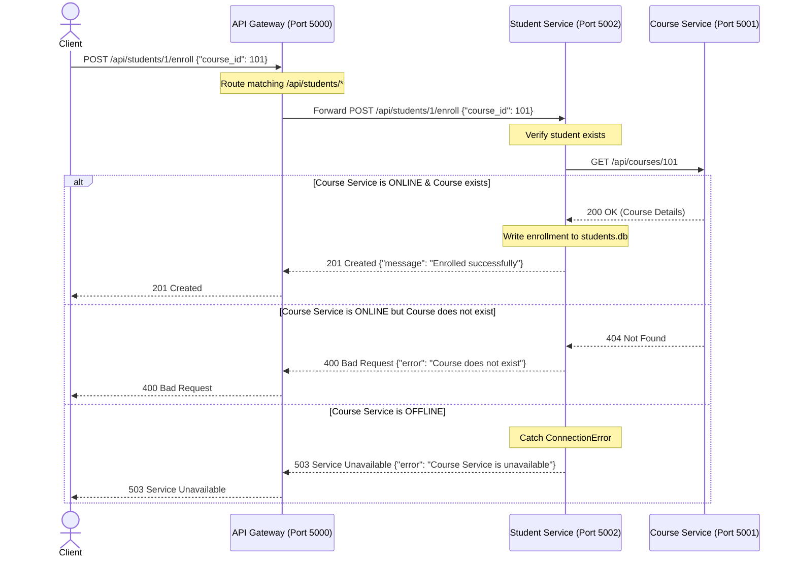

# Hands-On 10: Microservices Decomposition & API Gateway

This project demonstrates decomposing a monolithic Course Management system into two independent microservices (`course_service` and `student_service`) communicating synchronously via HTTP, with an API Gateway acting as a single entry point.

---

## Task 1: Bounded Contexts & Decomposition

The Course Management monolith is decomposed into separate services representing specific bounded contexts. Below is the documentation of the decomposition:

| Service Name | Responsibility | Endpoints it owns | Database it owns |
| :--- | :--- | :--- | :--- |
| **Course Service** | Department and course CRUD. | `/api/courses/`, `/api/courses/<id>`, `/api/departments/` | `courses.db` (SQLite) |
| **Student Service**| Student CRUD, course enrollment logic. | `/api/students/`, `/api/students/<id>`, `/api/students/<id>/enroll` | `students.db` (SQLite) |
| **Auth Service** *(Conceptual)* | User registration, login, token validation. | `/api/auth/register`, `/api/auth/login`, `/api/auth/validate` | `auth.db` (SQLite) |
| **Notification Service** *(Conceptual)* | Sending email notifications for enrollments, logins, etc. | Internal event handlers | `notifications.db` (SQLite) |

### Microservice Principle Applied: Database-per-Service
Each service completely owns its data. No service can directly query or modify another service's database. 
- `course_service` uses `courses.db`
- `student_service` uses `students.db`

---

## Task 2: Inter-Service Communication & API Gateway

### Architecture Diagram (Request Flow)

---

## Synchronous (HTTP) vs Asynchronous (Message Queue) Communication

### 1. Synchronous Communication (e.g., HTTP / gRPC)
*   **How it works**: The calling service sends a request and blocks (waits) until the target service processes the request and sends a response.
*   **Pros**:
    *   **Simplicity**: Straightforward to implement and reason about.
    *   **Immediate Feedback**: The caller knows the final outcome immediately (e.g. confirmation that the course exists).
    *   **Consistent State**: Easy to achieve immediate consistency.
*   **Cons**:
    *   **Temporal Coupling**: Both services must be online at the same time. If `course_service` goes down, the enrollment process fails entirely (as demonstrated in Task 2).
    *   **Latent Bottlenecks**: The overall response time is the sum of both service calls. Slow down in the target service slows down the caller.
    *   **Cascading Failures**: If not handled properly, failure in one downstream service can cascade and take down upstream services.

### 2. Asynchronous Communication (e.g., RabbitMQ / Apache Kafka)
*   **How it works**: The calling service publishes an event or message to a broker (e.g., "StudentEnrolledEvent") and immediately responds to the client. Other services subscribe to the broker and process messages at their own pace.
*   **Pros**:
    *   **Decoupling**: Services do not need to be online simultaneously. If the Notification service is down, the Student service can still enroll the student. The message will simply wait in the queue until the Notification service recovers.
    *   **Resiliency & Scale**: High traffic peaks are buffered by the message broker instead of overwhelming services.
    *   **Performance**: Non-blocking calls yield faster response times for user-facing actions.
*   **Cons**:
    *   **Eventual Consistency**: Data is not updated immediately across services. There is a time window where different databases are slightly out of sync.
    *   **Complexity**: Requires deploying, managing, and monitoring a message broker (e.g., Kafka or RabbitMQ).
    *   **Debugging Difficulties**: Harder to trace requests and transaction flows across asynchronous boundaries.

### When would you use a Message Queue instead?
You should use a message queue when:
1.  **Direct confirmation is not required**: Tasks like sending emails, processing payments (often batch-processed or asynchronous), updating search indexes, or logging audits.
2.  **High availability is critical**: In an e-commerce app, placing an order should not fail if the recommendation or email confirmation service is down.
3.  **Long-running tasks**: For example, background video encoding, generating monthly PDF reports, or scraping data.
